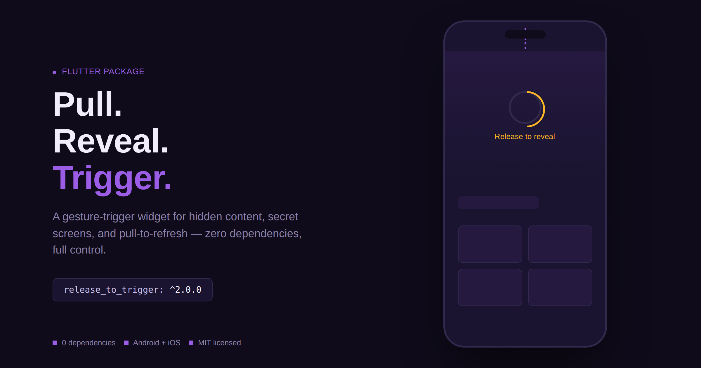
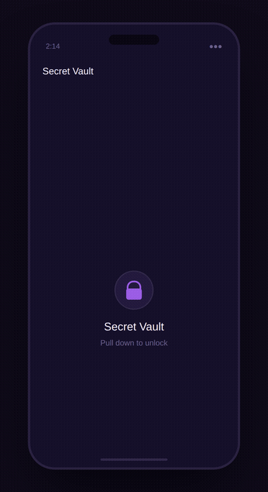
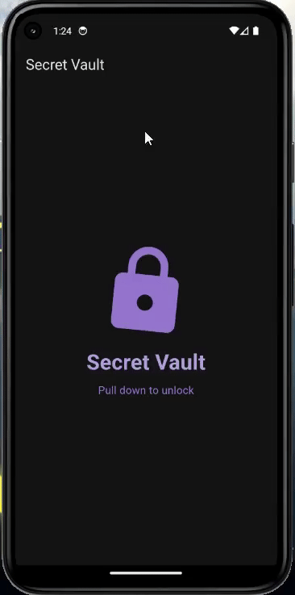
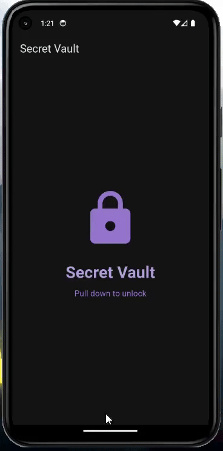
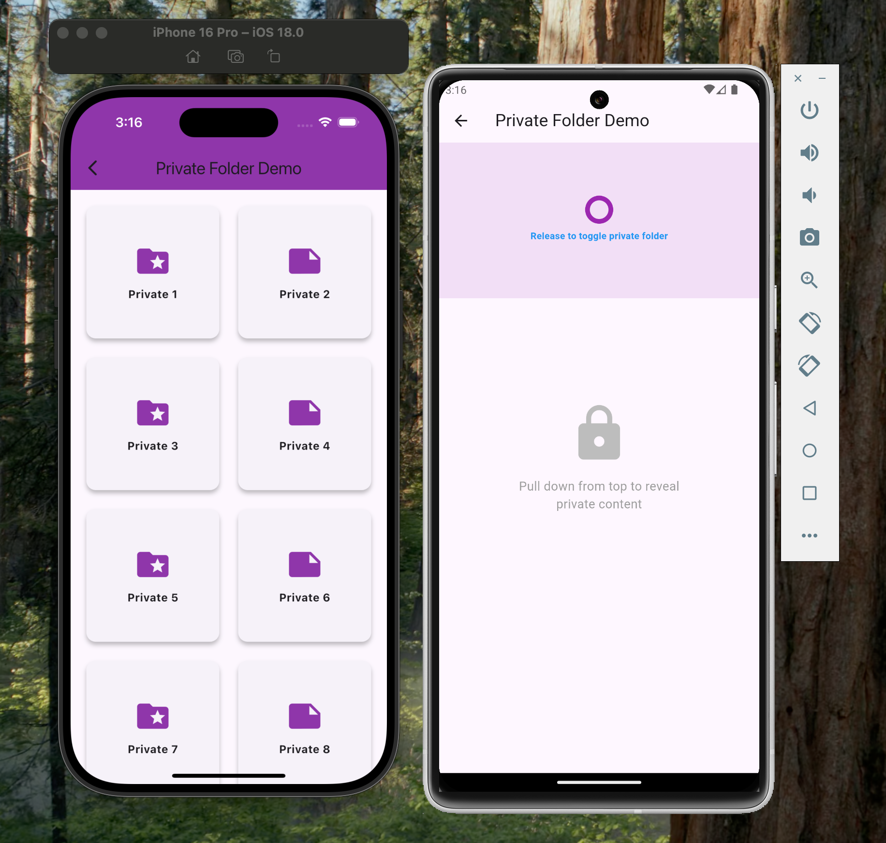
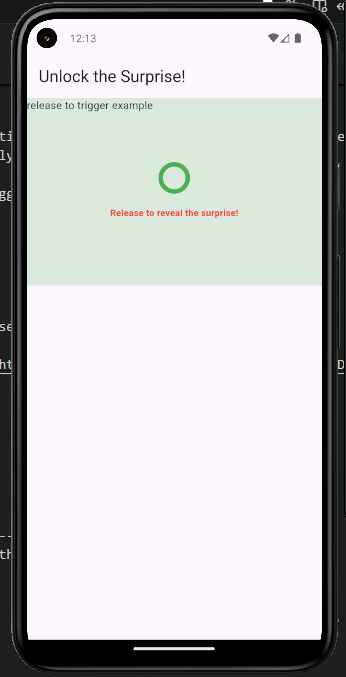
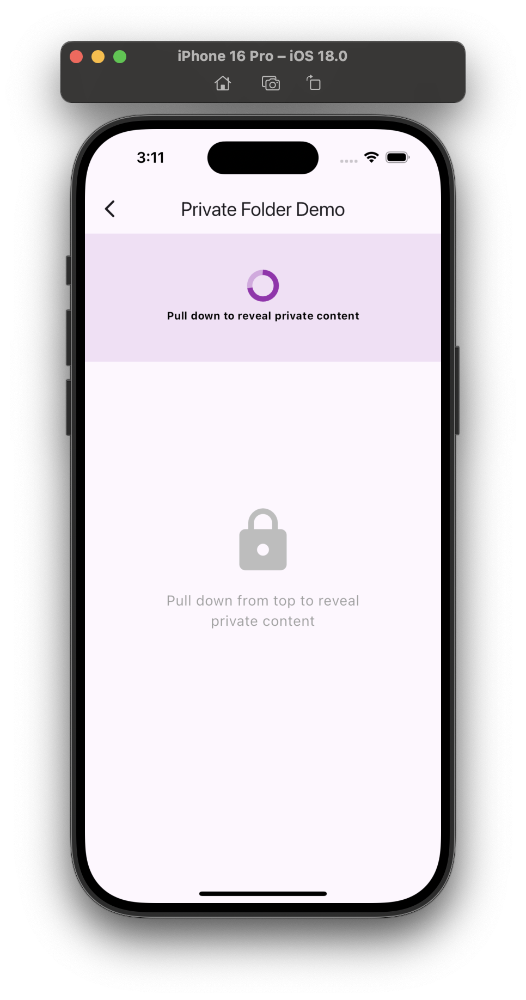

# **`release_to_trigger`** - Pull-to-Reveal & Gesture Action Primitive 📱✨

<p align="center">
  
</p>

<p align="center">
  <a href="https://pub.dev/packages/release_to_trigger"></a>
  <a href="https://opensource.org/licenses/MIT"></a>
</p>

`release_to_trigger` is a highly customizable, zero-third-party-runtime-dependency **pull-to-reveal** and **swipe-to-trigger** gesture primitive for Flutter. 

Unlike generic pull-to-refresh widgets designed solely for list updates, `release_to_trigger` is a general-purpose interaction wrapper. It lets you capture vertical and horizontal swipe gestures to unlock secret folders, reveal hidden widgets, trigger custom screen actions, build secure lock combos, or run standard pull-to-refresh logic with fluid visual feedback.

---

## 🏆 Key Features

- **General-Purpose Gesture Wrapper**: Wrap any widget to intercept pulls (down, up, left, right) and run arbitrary actions.
- **Named Constructor `ReleaseToTrigger.refresh`**: Built-in support for asynchronous refresh tasks. Holds the loading state widget visible until the future completes.
- **Multi-Stage Triggers (`TriggerStage`)**: Support multi-threshold drags (e.g., halfway, threshold, overpull) with custom status labels and step callbacks (`onStageReached`).
- **Secure Combo Lock Mode**: Require users to press and hold (configurable duration) before dragging is unlocked. Features custom glassmorphic progress overlays.
- **Real-Time Progress Hook (`onProgressTick`)**: Subscribe to the pull progress stream (0.0 to 1.0+) to wire up custom audio, dynamic haptics, or advanced visual effects.
- **Shake-to-Cancel**: Automatically cancel drag gestures if the user shakes the device (powered by the trusted `sensors_plus` package).
- **Haptic Feedback**: High-fidelity tactile feedback out of the box when reaching thresholds and completing gestures.

---

## 📸 Interactive Demos & Showcases

### 🔐 Secure Combo Lock (Long Press + Swipe down)
The user holds their thumb on the fingerprint scanner to disarm the lock, then swipes down to trigger the vault unlock. Includes a hardware shake-to-cancel "panic" feature!

<p align="center">
  
</p>

### ⚙️ Multi-Directional & Multi-Stage Pulling

| Top Pull-Down (Standard) | Bottom Pull-Up | Horizontal Swipe-to-Reveal |
|:---:|:---:|:---:|
|  |  |  |

### 📱 Real-World App Console Screens

| 1. Locked Console | 2. Fingerprint Scanning | 3. Decrypted Vault |
|:---:|:---:|:---:|
|  |  |  |

---

## 🚀 Getting Started

Add the package to your `pubspec.yaml` file:

```yaml
dependencies:
  release_to_trigger: ^2.1.0
```

Import the package in your Dart code:

```dart
import 'package:release_to_trigger/release_to_trigger.dart';
```

---

## 📖 Step-by-Step Tutorial

For a detailed walkthrough on how to build a physical-feeling **Secret Vault** with fingerprint scanning (long press), dynamic haptic ticks, and shake-to-cancel mechanics, check out the official step-by-step guide on Medium:

👉 **[Building a Physical-Feeling "Secret Vault" in Flutter: Advanced Haptic & Gesture Mechanics](https://medium.com/@tejaspalyekar18/building-a-physical-feeling-secret-vault-in-flutter-advanced-haptic-gesture-mechanics-89ef64fc2913)**

---

## 🔧 Developer Recipes & Code Snippets

### 1. Basic Pull-to-Reveal
Simple wrapper that reveals a private dashboard panel when the user pulls down from the top edge.

```dart
ReleaseToTrigger(
  initialText: 'Pull down to reveal private panel',
  triggeredText: 'Release to unlock',
  backgroundColor: Colors.blue.withAlpha(20),
  progressColor: Colors.blue,
  triggerHeight: 120.0,
  onTrigger: () {
    setState(() {
      _showPanel = true;
    });
  },
  child: const HomeScreenBody(),
)
```

### 2. Standard Pull-to-Refresh (`ReleaseToTrigger.refresh`)
Uses the dedicated async refresh constructor. The refresh container remains visible until the future resolved.

```dart
ReleaseToTrigger.refresh(
  onRefresh: () async {
    // Perform network request or DB reload
    await Future.delayed(const Duration(seconds: 2));
  },
  child: ListView.builder(
    itemCount: 20,
    itemBuilder: (context, index) => ListTile(title: Text('Item $index')),
  ),
)
```

### 3. Multi-Stage Pulling with Overpull (`TriggerStage`)
Triggers intermediate callbacks and updates labels as the user pulls past different thresholds.

```dart
ReleaseToTrigger(
  triggerHeight: 120.0,
  stages: [
    TriggerStage(
      threshold: 0.5,
      label: 'Stage 1: Pull further...',
      textStyle: TextStyle(color: Colors.orange, fontSize: 14),
      onStageReached: () => print('Halfway there!'),
    ),
    TriggerStage(
      threshold: 1.0,
      label: 'Stage 2: Release to open!',
      textStyle: TextStyle(color: Colors.green, fontWeight: FontWeight.bold),
      onStageReached: () => HapticFeedback.mediumImpact(),
    ),
    TriggerStage(
      threshold: 1.5,
      label: 'Stage 3: OVERPULL UNLOCKED!',
      textStyle: TextStyle(color: Colors.red, fontSize: 16),
      onStageReached: () => HapticFeedback.vibrate(),
    ),
  ],
  onTrigger: () {
    print('Action triggered!');
  },
  child: const DashboardView(),
)
```

### 4. Secure Vault Lock (Long-Press-then-Pull Combo)
Requires the user to press and hold for 800ms before they can pull to open the folder.

```dart
ReleaseToTrigger(
  requireLongPressBeforePull: true,
  longPressDuration: const Duration(milliseconds: 800),
  initialText: 'Hold still, then pull down',
  triggeredText: 'Release to decrypt',
  
  // Custom glassmorphic hold progress ring
  longPressProgressBuilder: (context, progress) {
    return Container(
      padding: const EdgeInsets.all(16),
      decoration: BoxDecoration(
        color: Colors.black.withAlpha(120),
        shape: BoxShape.circle,
      ),
      child: CircularProgressIndicator(
        value: progress,
        color: Colors.greenAccent,
      ),
    );
  },
  onTrigger: () => _openSecureVault(),
  child: const VaultLandingView(),
)
```

### 5. Advanced Shake-to-Cancel
If the user pulls the container down but changes their mind, they can shake their device to cancel the gesture.

#### Built-in Integration (requires `sensors_plus` dependency configuration):
```dart
ReleaseToTrigger(
  enableShakeToCancel: true, // Shaking during active drag collapses it automatically
  onTrigger: () => _doSomething(),
  child: const MyWidget(),
)
```

#### Custom Shake Receiver Recipe:
If you want custom accelerometer parameters, you can listen to the stream manually and trigger a collapse using a key or state toggle:
```dart
import 'dart:async';
import 'package:sensors_plus/sensors_plus.dart';

// In your State class:
StreamSubscription? _sensorSub;

void startShakeDetection(VoidCallback onShake) {
  _sensorSub = userAccelerometerEventStream().listen((event) {
    final double force = event.x.abs() + event.y.abs() + event.z.abs();
    if (force > 15.0) { // Customize your threshold
      onShake();
    }
  });
}

@override
void dispose() {
  _sensorSub?.cancel();
  super.dispose();
}
```

---

## 📚 Parameter Documentation

### Core Configuration

| Parameter | Type | Default | Description |
|---|---|---|---|
| `onTrigger` | `Function` | Required | Callback triggered when the user releases drag past the threshold. |
| `child` | `Widget` | Required | The content widget wrapped with the gesture recognition layer. |
| `onRefresh` | `Future<void> Function()?` | `null` | Only available in `ReleaseToTrigger.refresh`. Holds visual loading state until resolved. |

### Visual Options

| Parameter | Type | Default | Description |
|---|---|---|---|
| `backgroundColor` | `Color?` | `Colors.transparent` | Background color of the revealed pull drawer. |
| `progressColor` | `Color?` | `Colors.blue` | Color of the progress indicators. |
| `progressBackgroundColor` | `Color?` | `null` | Track background color of the circular progress indicator. |
| `progressStrokeWidth` | `double` | `6.0` | Stroke thickness of the circular progress indicator. |
| `padding` | `EdgeInsetsGeometry?` | `EdgeInsets.symmetric(vertical: 16, horizontal: 16)` | Inner padding for the pull-to-trigger container drawer. |
| `spacing` | `double` | `12.0` | Spacing between the progress indicator and the text status label. |
| `initialText` | `String?` | `'Swipe to trigger'` | Instruction text displayed during initial pull. |
| `triggeredText` | `String?` | `'Release to trigger action'` | Instruction text displayed once threshold is crossed. |
| `initialTextStyle` | `TextStyle?` | `TextStyle(fontSize: 12)` | Text style for the initial text. |
| `triggerTextStyle` | `TextStyle?` | `TextStyle(fontSize: 12, color: Colors.blue)` | Text style for the active trigger text. |
| `showProgressIndicator` | `bool?` | `true` | Whether to show the build indicator. |
| `progressIndicatorType` | `ProgressIndicatorType` | `ProgressIndicatorType.circular` | Indicator type: `.circular`, `.rotatingIcon`, `.scalingIcon`, `.fadingIcon`, or `.custom`. |
| `progressIcon` | `IconData?` | `Icons.refresh` | Icon used in icon-based progress indicator types. |
| `progressIconSize` | `double` | `30.0` | Size of the progress indicator icon. |
| `progressImage` | `ImageProvider?` | `null` | Custom image/asset used for image scaling or fading. |
| `progressBuilder` | `Widget Function(double)?` | `null` | A builder function for fully custom indicator layouts. |

### Gesture & Motion Behavior

| Parameter | Type | Default | Description |
|---|---|---|---|
| `triggerHeight` | `double?` | `250.0` | Drag distance required to reach 100% trigger status. |
| `pullSensitivityHeight` | `double?` | `250.0` | Boundary zone near the screen edge where gestures are captured. |
| `top` | `bool?` | `true` | Pull anchor side: `true` (top down), `false` (bottom up). |
| `left` | `bool?` | `true` | Horizontal anchor side: `true` (left to right), `false` (right to left). |
| `enableHorizontalSwipe` | `bool` | `false` | Enables left-to-right or right-to-left pull. |
| `swipeDirection` | `Axis` | `Axis.vertical` | Swipe tracking axis constraint. |
| `dragThreshold` | `double` | `10.0` | Minimum movement threshold before showing the drag drawer (prevents jitter). |
| `preventScrollingWhileDragging` | `bool` | `true` | Locks child scroll interaction while pulling down. |
| `stages` | `List<TriggerStage>?` | `null` | Intermediate trigger threshold stages. |
| `onProgressTick` | `void Function(double)?` | `null` | Callback for real-time progress (e.g., custom sound pitches). |

### Security & Hardware Features

| Parameter | Type | Default | Description |
|---|---|---|---|
| `requireLongPressBeforePull` | `bool` | `false` | Locks dragging until a long press completes. |
| `longPressDuration` | `Duration` | `500ms` | Holding duration needed to unlock swipe gesture. |
| `longPressProgressBuilder` | `Widget Function(BuildContext, double)?` | `null` | Builder for custom holding indicator visual feedback. |
| `enableShakeToCancel` | `bool` | `false` | Integrates `sensors_plus` to cancel drag on shaking the device. |
| `hapticFeedback` | `bool` | `true` | Vibrates the device when crossing thresholds and triggering. |

---

## 🔄 Migration Guide (v1.x to v2.x)

Version `2.x` modernizes gesture physics and resolves critical parameters that were previously silent no-ops:

1. **Horizontal Swipe physics**:
   - Setting `enableHorizontalSwipe: true` and `swipeDirection: Axis.horizontal` now correctly tracks horizontal drag vectors instead of vertical vectors.
   - Anchors left-to-right swipe with `left: true` and right-to-left swipe with `left: false`.
2. **Strict Sensitivity Anchoring**:
   - `pullSensitivityHeight` is now strictly enforced relative to the active screen edge. Dragging inside the middle of a screen will no longer intercept and trigger pull overlays.
3. **Scroll Prevention**:
   - `preventScrollingWhileDragging: true` correctly absorbs touch events during pull updates, preventing under-scroll jitter on listviews.

---

## ⭐ Show Your Support

If you find `release_to_trigger` helpful, please star the repository on [GitHub](https://github.com/tejaspalyekar/release_to_trigger) and leave a like on [pub.dev](https://pub.dev/packages/release_to_trigger). We welcome community contributions and feature requests!