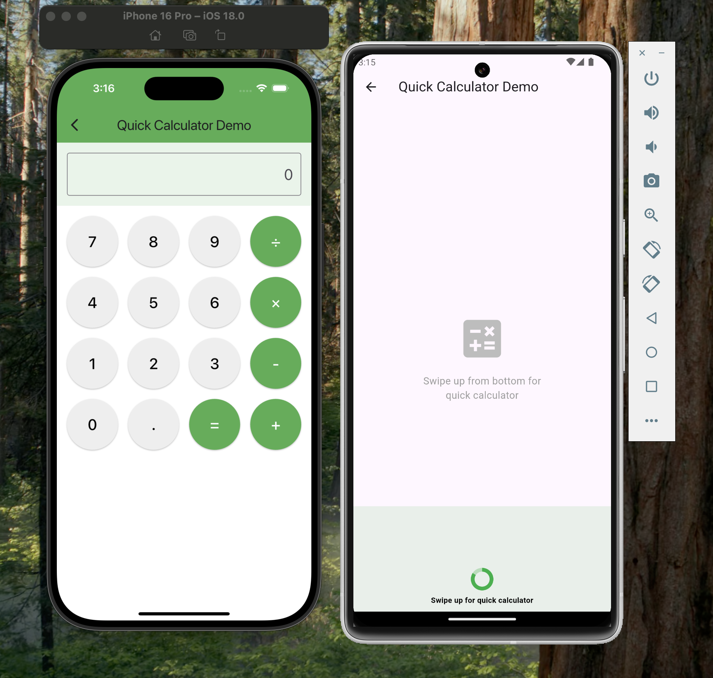

# **`ReleaseToTrigger`**

**`ReleaseToTrigger`** is a highly customizable Flutter widget that captures vertical swipe gestures and triggers actions upon release at a defined threshold. Ideal for enhancing user experiences with pull-to-refresh, content loading, or any custom interactive feature.

---

## 🌟 Features

- **Swipe to Trigger Actions**: Capture vertical swipe gestures and trigger actions when the user releases the swipe at a defined height.
- **Fully Customizable**: Modify the look and feel with adjustable background colors, progress indicators, and texts.
- **Two-Way Swipe Support**: Detect swipe gestures from both the top and bottom of the screen.
- **Real-Time Progress Feedback**: Keep users informed with a responsive, circular progress indicator as they swipe.
- **Smooth Integration**: Trigger your custom actions via a callback when the defined swipe threshold is reached.
- **Adaptive Sensitivity**: Fine-tune how far the user must swipe to activate the trigger.

---

## 📸 Screenshots

Here’s how `ReleaseToTrigger` works in action:

| Initial State                                    | Triggered State                                   |
|--------------------------------------------------|---------------------------------------------------|
|               |              |

---

## 🚀 Getting Started

### Installation

Add the `release_to_trigger` package to your project by including it in your `pubspec.yaml`:

```yaml
dependencies:
  release_to_trigger: ^0.0.2
```

Then, run the following command to install it:

```bash
flutter pub get
```

---

## 🔧 Example Usage

Here’s a quick example to show how `ReleaseToTrigger` can be implemented in your app for an interactive swipe action:

```dart
ReleaseToTrigger(
  backgroundColor: Colors.green.withOpacity(0.2),
  progressColor: Colors.green,
  initialText: 'Pull down to unlock the surprise',
  triggeredText: 'Release to reveal the surprise!',
  triggerHeight: 250.0,
  pullSensitivityHeight: 250,
  onTrigger: () {
    // Your custom action here
    Navigator.of(context).push(
      ModalBottomSheetRoute(
        useSafeArea: true,
        showDragHandle: true,
        builder: (context) => const Center(
          child: Text("Action Triggered"),
        ),
      ),
    );
  },
  child: const Text("Swipe to trigger example"),
);
```

---

## ⚙️ Parameters

- **`backgroundColor`** *(Color)*: Sets the background color for the pull container.
- **`progressColor`** *(Color)*: Color of the circular progress indicator.
- **`initialText`** *(String)*: Text shown during the pull before reaching the trigger height.
- **`triggeredText`** *(String)*: Text displayed when the user reaches the trigger threshold.
- **`triggerHeight`** *(double)*: The height (in pixels) that must be reached before triggering the action.
- **`pullSensitivityHeight`** *(double)*: Sensitivity of the pull gesture.
- **`top`** *(bool)*: Whether to trigger from the top (`true`) or bottom (`false`) of the screen.
- **`onTrigger`** *(Function)*: Callback function executed when the trigger height is reached and the user releases.
- **`child`** *(Widget)*: The main widget content wrapped by `ReleaseToTrigger`.
- **`initialTextColor`** *(TextStyle)*: Customizable style for the initial pull text.
- **`triggerTextStyle`** *(TextStyle)*: Customizable style for the triggered text.

---

## 💡 How It Works

1. **Detect Pull Gestures**: The widget detects the user’s pull gestures and tracks progress based on the swipe height.
2. **Interactive Feedback**: A progress indicator updates in real-time as the user approaches the trigger point.
3. **Trigger Actions**: When the user reaches the trigger height and releases, the specified action is executed via the callback.

---

## 📈 Planned Features

- **Horizontal Swipe Detection**: Expanding functionality to support horizontal swipes.
- **Animation Enhancements**: Further customization of pull and release animations.
- **Edge Case Handling**: More robust support for fast and complex swipe gestures.

---

## 📜 License

This project is licensed under the MIT License. See the [LICENSE](LICENSE) file for details.

---

Feel free to reach out for feedback!

---